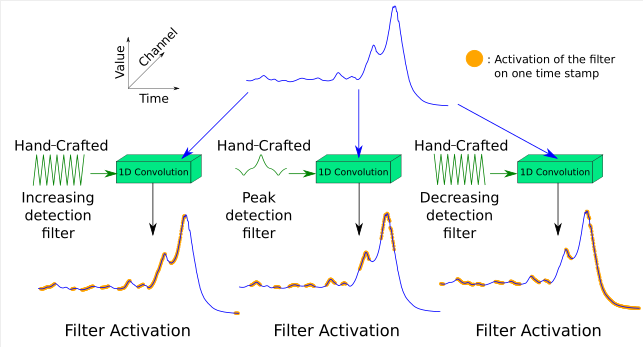
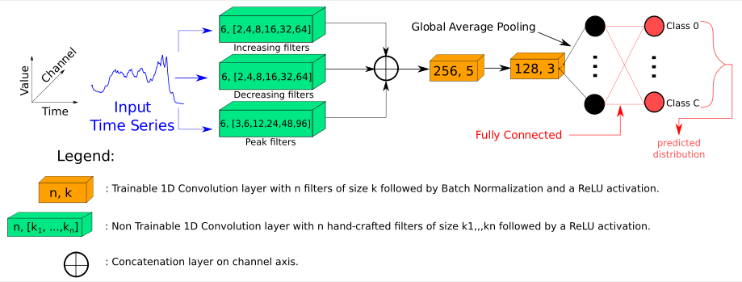
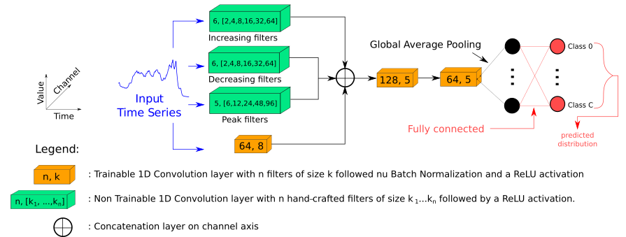
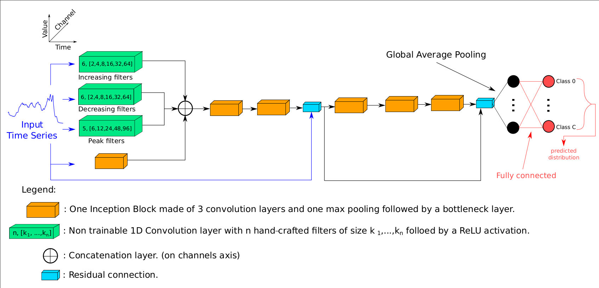
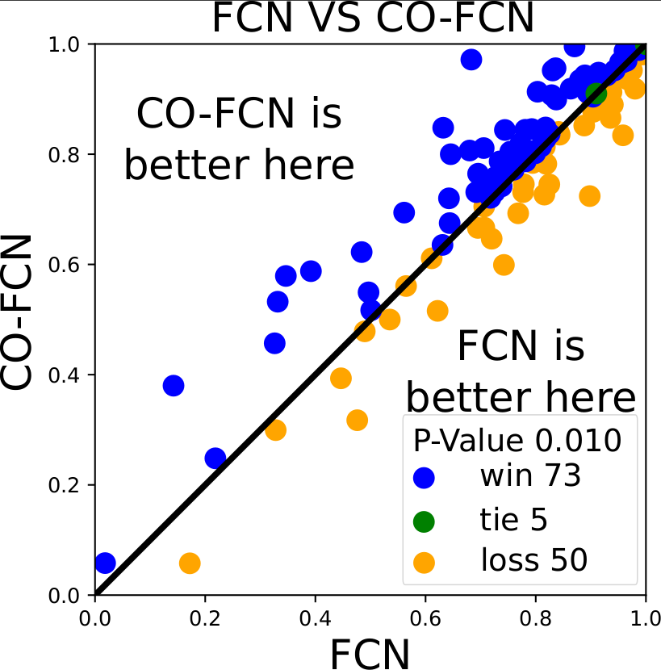
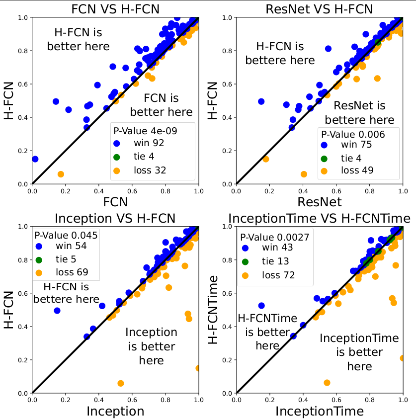
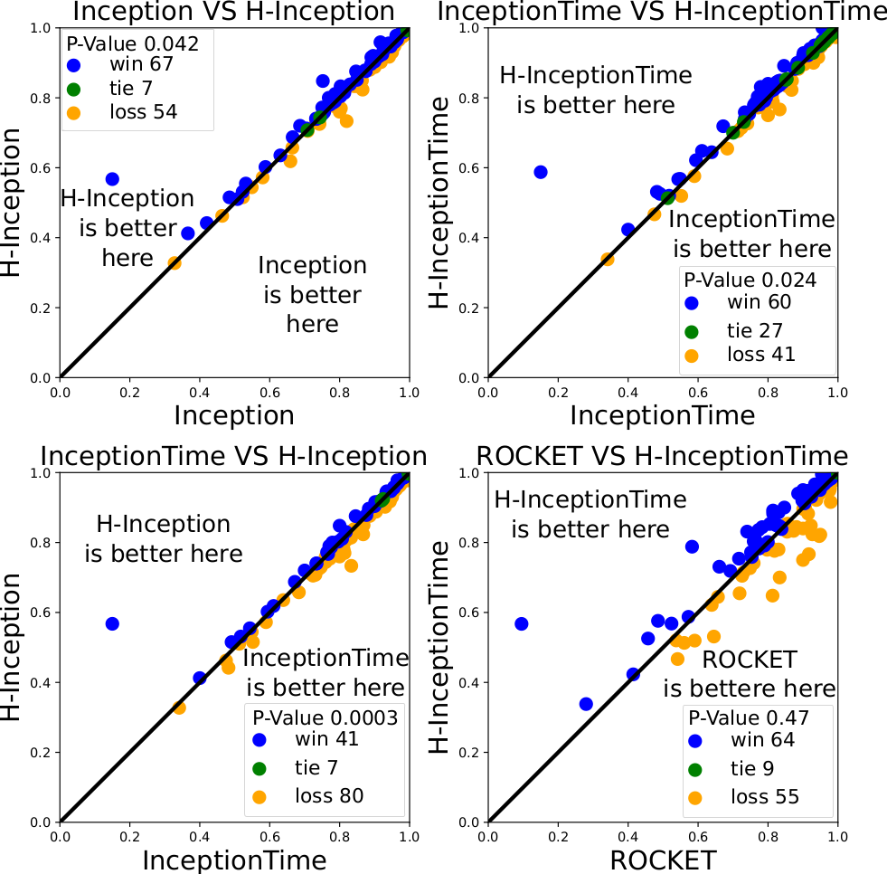
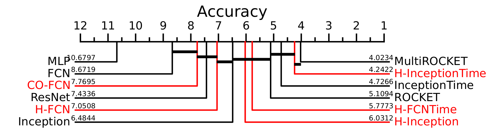
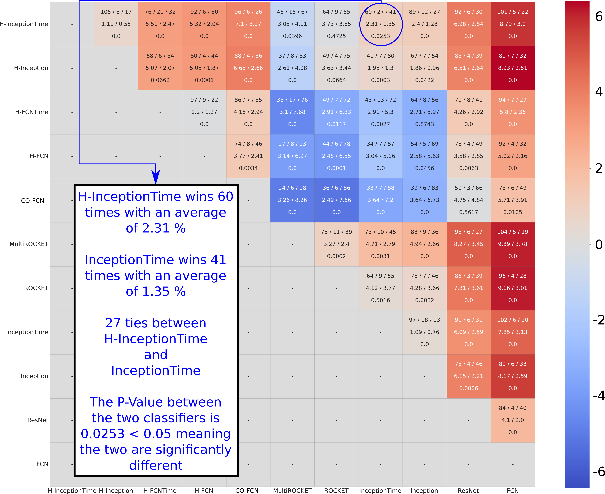

# Deep Learning For Time Series Classification Using New Hand-Crafted Convolution Filters

This is the code of our paper "Deep Learning For Time Series Classification Using New Hand-Crafted Convolution Filters" accepted as a regular paper at [2022 IEEE Internation Conference on Big Data](https://bigdataieee.org/BigData2022/).<br>
This work was done by [Ali Ismail-Fawaz](https://hadifawaz1999.github.io/), [Maxime Devanne](https://maxime-devanne.com/), [Jonathan Weber](https://www.jonathan-weber.eu/) and [Germain Forestier](https://germain-forestier.info/).

## Summary of proposed custom filters


<p align="center" width="100%">

</p>

## Architectures:

### Architecture 1: Custom Only Fully Convolutional Network (CO-FCN)



### Architecture 2: Hybrid Fully Convolutional Network (H-FCN)



### Architecture 3: Hybrid Inception (H-Inception) and Hybrid InceptionTime (H-InceptionTime)<br>
Note: H-InceptionTime is an ensemble of five H-Inception models, such as in [H. Ismail Fawaz et al.](https://github.com/hfawaz/InceptionTime)



## Usage of code

In order to run an experiment on a dataset of the [UCR Archive](https://www.cs.ucr.edu/~eamonn/time_series_data/) with a specific classifier of three proposed above, simply run the ```main.py``` file. <br>
This file takes as arguments the following:<br>
```
--dataset : The dataset to be used, by default "Coffee" is used<br>
--classifier : The classifier to be used, choices = ['CO-FCN', 'H-FCN', 'H-Inception'], by default 'H-Inception' is used
--runs : The number of experiments to be done, by default five are done
--output-directory : The output directory, by default the output is saved into 'results/'
```

## Results

### CO-FCN -- see [results csv](results/CO-FCN/results_UCR_128.csv) on the 128 datasets of the [UCR Archive](https://www.cs.ucr.edu/~eamonn/time_series_data/)



### H-FCN -- see [results csv](results/H-FCN/results_UCR_128.csv) on the 128 datasets of the [UCR Archive](https://www.cs.ucr.edu/~eamonn/time_series_data/)




### H-Inception -- see [results csv](results/H-Inception/results_UCR_128.csv) on the 128 datasets of the [UCR Archive](https://www.cs.ucr.edu/~eamonn/time_series_data/)




## Critical Difference Diagram, using the code of [H. Ismail Fawaz et al.](https://github.com/hfawaz/cd-diagram)



## Matrix 1v1 Comparison



## Requirements

For a ```conda``` environment see [requirement file](requirements_conda.txt)<br>

For a ```pip``` environment see [requirement file](requirement_pip.txt )<br>
